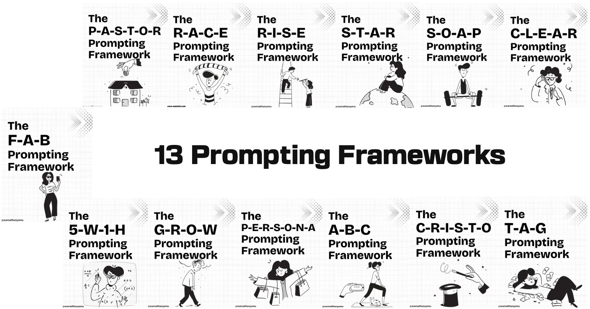

<div id="top"></div>
<!--
*** Thanks for checking out the Best-README-Template. If you have a suggestion
*** that would make this better, please fork the repo and create a pull request
*** or simply open an issue with the tag "enhancement".
*** Don't forget to give the project a star!
*** Thanks again! Now go create something AMAZING! :D
-->


<!-- PROJECT SHIELDS -->
<!--
*** I'm using markdown "reference style" links for readability.
*** Reference links are enclosed in brackets [ ] instead of parentheses ( ).
*** See the bottom of this document for the declaration of the reference variables
*** for contributors-url, forks-url, etc. This is an optional, concise syntax you may use.
*** https://www.markdownguide.org/basic-syntax/#reference-style-links
-->
[![Contributors][contributors-shield]][contributors-url]
[![Forks][forks-shield]][forks-url]
[![Stargazers][stars-shield]][stars-url]
[![Issues][issues-shield]][issues-url]
[![MIT License][license-shield]][license-url]
[![LinkedIn][linkedin-shield]][linkedin-url]


<!-- PROJECT LOGO -->

<!-- Accompanying blog can be found [here](https://wamaithanyamu.com/
) -->
<div>
<h3 align="center">Prompting techniques for better LLM outputs.
</h3>


</div>

<!-- GETTING STARTED -->
### Prerequisites

1. A Gemini API Key
2. NodeJS 20+

### Getting started
Install dependencies with npm
```sh
npm install
```
Create a `.env` file
```sh
touch .env
```
Add the Gemini api key in the .env
```sh
GEMINI_API_KEY=<add-key-here>
```
Run the code
```sh
npm run start
```

### Roadmap

- ✅ The R-A-C-E Prompting Framework
- [ ] The P-A-S-T-O-R Prompting Framework
- [ ] The R-I-S-E Prompting Framework
- [ ] The S-T-A-R Prompting Framework
- [ ] The S-O-A-P Prompting Framework
- [ ] The C-L-E-A-R Prompting Framework
- [ ] The F-A-B Prompting Framework
- [ ] The 5-W-1-H Prompting Framework
- [ ] The G-R-O-W Prompting Framework
- [ ] The P-E-R-S-O-N-A Prompting Framework
- [ ] The A-B-C Prompting Framework
- [ ] The C-R-I-S-T-O Prompting Framework
- [ ] The T-A-G Prompting Framework

See the [open issues](https://github.com/wamaithanyamu/promptEngineeringTechniques/issues) for a full list of proposed features (and known issues).


<!-- CONTRIBUTING -->
## Contributing

Contributions are what make the open source community such an amazing place to learn, inspire, and create. Any contributions you make are **greatly appreciated**.

If you have a suggestion that would make this better, please fork the repo and create a pull request. You can also simply open an issue with the tag "enhancement".
Don't forget to give the project a star! Thanks again!

1. Fork the Project
2. Create your Feature Branch (`git checkout -b feature/AmazingFeature`)
3. Commit your Changes (`git commit -m 'Add some AmazingFeature'`)
4. Push to the Branch (`git push origin feature/AmazingFeature`)
5. Open a Pull Request


<!-- LICENSE -->
## License

Distributed under the MIT License. See `LICENSE.txt` for more information.
<p align="right">(<a href="#top">back to top</a>)</p>


<!-- CONTACT -->
## Contact
Tweet me at- [@wamaithanyamu](https://twitter.com/wamaithanyamu) or shoot me an email at hello@wamaithanyamu.com

Project Link: [https://github.com/wamaithanyamu/promptEngineeringTechniques
](https://github.com/wamaithanyamu/promptEngineeringTechniques)

<p align="right">(<a href="#top">back to top</a>)</p>


<!-- MARKDOWN LINKS & IMAGES -->
<!-- https://www.markdownguide.org/basic-syntax/#reference-style-links -->
[contributors-shield]: https://img.shields.io/github/contributors/wamaithanyamu/promptEngineeringTechniques.svg?style=for-the-badge

[contributors-url]: https://github.com/wamaithanyamu/promptEngineeringTechniques/graphs/contributors

[forks-shield]: https://img.shields.io/github/forks/wamaithanyamu/promptEngineeringTechniques.svg?style=for-the-badge

[forks-url]: https://github.com/wamaithanyamu/promptEngineeringTechniques/network/members

[stars-shield]: https://img.shields.io/github/stars/wamaithanyamu/promptEngineeringTechniques.svg?style=for-the-badge

[stars-url]: https://github.com/wamaithanyamu/promptEngineeringTechniques/stargazers


[issues-shield]: https://img.shields.io/github/issues/wamaithanyamu/promptEngineeringTechniques.svg?style=for-the-badge

[issues-url]: https://github.com/wamaithanyamu/promptEngineeringTechniques/issues

[license-shield]: https://img.shields.io/github/license/wamaithanyamu/promptEngineeringTechniques.svg?style=for-the-badge


[license-url]: https://github.com/wamaithanyamu/promptEngineeringTechniques/blob/master/LICENSE.txt

[linkedin-shield]: https://img.shields.io/badge/-LinkedIn-black.svg?style=for-the-badge&logo=linkedin&colorB=555
[linkedin-url]: https://linkedin.com/in/wamaithanyamu
[product-screenshot]: Images/cover.jpg
